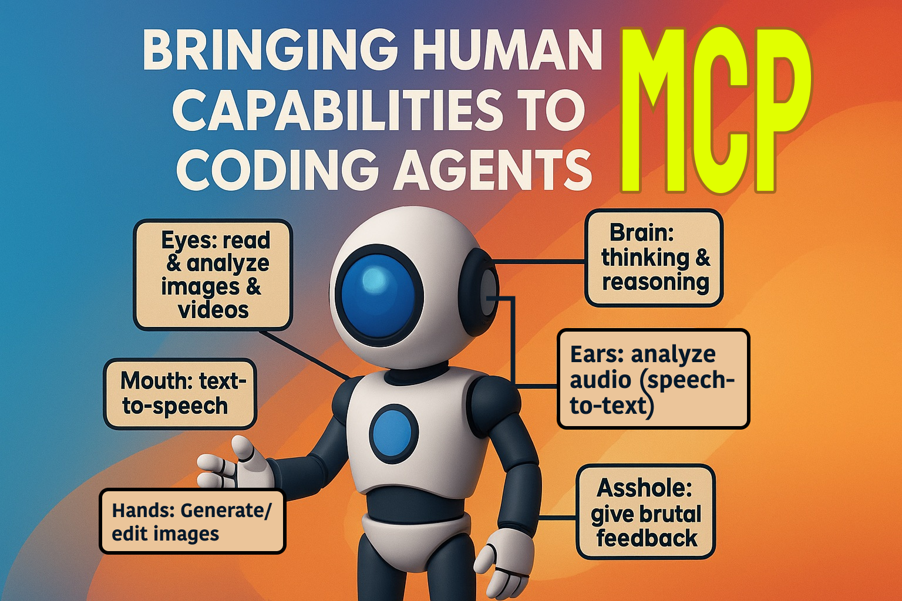

# Human MCP 👁️

> Bringing Human Capabilities to Coding Agents



Human MCP is a Model Context Protocol server that provides AI coding agents with human-like visual capabilities for debugging and understanding visual content like screenshots, recordings, and UI elements.

## Features

🎯 **Visual Analysis**
- Analyze screenshots for UI bugs and layout issues
- Process screen recordings to understand error sequences  
- Extract insights from GIFs and animations
- Compare visual changes between versions

🔍 **Specialized Analysis Types**
- **UI Debug**: Layout issues, rendering problems, visual bugs
- **Error Detection**: Visible errors, broken functionality, system failures
- **Accessibility**: Color contrast, WCAG compliance, readability
- **Performance**: Loading states, visual performance indicators
- **Layout**: Responsive design, positioning, visual hierarchy

🤖 **AI-Powered**
- Uses Google Gemini 2.5 Flash for fast, accurate analysis
- Detailed technical insights for developers
- Actionable recommendations for fixing issues
- Structured output with detected elements and coordinates

## Quick Start

### Getting Your Google Gemini API Key

Before installation, you'll need a Google Gemini API key to enable visual analysis capabilities.

#### Step 1: Access Google AI Studio
1. Visit [Google AI Studio](https://aistudio.google.com/) in your web browser
2. Sign in with your Google account (create one if needed)
3. Accept the terms of service when prompted

#### Step 2: Create an API Key
1. In the Google AI Studio interface, look for the "Get API Key" button or navigate to the API keys section
2. Click "Create API key" or "Generate API key"
3. Choose "Create API key in new project" (recommended) or select an existing Google Cloud project
4. Your API key will be generated and displayed
5. **Important**: Copy the API key immediately as it may not be shown again

#### Step 3: Secure Your API Key
⚠️ **Security Warning**: Treat your API key like a password. Never share it publicly or commit it to version control.

**Best Practices:**
- Store the key in environment variables (not in code)
- Don't include it in screenshots or documentation
- Regenerate the key if accidentally exposed
- Set usage quotas and monitoring in Google Cloud Console
- Restrict API key usage to specific services if possible

#### Step 4: Set Up Environment Variable
Configure your API key using one of these methods:

**Method 1: Shell Environment (Recommended)**
```bash
# Add to your shell profile (.bashrc, .zshrc, .bash_profile)
export GOOGLE_GEMINI_API_KEY="your_api_key_here"

# Reload your shell configuration
source ~/.zshrc  # or ~/.bashrc
```

**Method 2: Project-specific .env File**
```bash
# Create a .env file in your project directory
echo "GOOGLE_GEMINI_API_KEY=your_api_key_here" > .env

# Add .env to your .gitignore file
echo ".env" >> .gitignore
```

**Method 3: MCP Client Configuration**
You can also provide the API key directly in your MCP client configuration (shown in setup examples below).

#### Step 5: Verify API Access
Test your API key works correctly:

```bash
# Test with curl (optional verification)
curl -H "Content-Type: application/json" \
     -d '{"contents":[{"parts":[{"text":"Hello"}]}]}' \
     -X POST "https://generativelanguage.googleapis.com/v1beta/models/gemini-pro:generateContent?key=YOUR_API_KEY"
```

#### Alternative Methods for API Key

**Using Google Cloud Console:**
1. Go to [Google Cloud Console](https://console.cloud.google.com/)
2. Create a new project or select existing one
3. Enable the "Generative AI API" 
4. Go to "Credentials" > "Create Credentials" > "API Key"
5. Optionally restrict the key to specific APIs and IPs

**API Key Restrictions (Recommended):**
- Restrict to "Generative AI API" only
- Set IP restrictions if using from specific locations
- Configure usage quotas to prevent unexpected charges
- Enable API key monitoring and alerts

#### Troubleshooting API Key Issues

**Common Problems:**
- **Invalid API Key**: Ensure you copied the complete key without extra spaces
- **API Not Enabled**: Make sure Generative AI API is enabled in your Google Cloud project
- **Quota Exceeded**: Check your usage limits in Google Cloud Console  
- **Authentication Errors**: Verify the key hasn't expired or been revoked

**Testing Your Setup:**
```bash
# Verify environment variable is set
echo $GOOGLE_GEMINI_API_KEY

# Should output your API key (first few characters)
```

### Prerequisites

- Node.js v18+ or [Bun](https://bun.sh) v1.2+
- Google Gemini API key (configured as shown above)

### Installation

Install Human MCP as an npm package:

```bash
# Using npm
npm install -g @goonnguyen/human-mcp

# Using bun (recommended)
bun install -g @goonnguyen/human-mcp

# Using pnpm
pnpm install -g @goonnguyen/human-mcp
```

### Environment Setup

Configure your Google Gemini API key:

```bash
# Option 1: Environment variable (recommended)
export GOOGLE_GEMINI_API_KEY="your_api_key_here"

# Option 2: Add to your shell profile
echo 'export GOOGLE_GEMINI_API_KEY="your_api_key_here"' >> ~/.zshrc
source ~/.zshrc
```

### Development (For Contributors)

If you want to contribute to Human MCP development:

```bash
# Clone the repository
git clone https://github.com/human-mcp/human-mcp.git
cd human-mcp

# Install dependencies  
bun install

# Copy environment template
cp .env.example .env

# Add your Gemini API key to .env
GOOGLE_GEMINI_API_KEY=your_api_key_here

# Start development server
bun run dev

# Build for production
bun run build

# Run tests
bun test

# Type checking
bun run typecheck
```

### Usage with MCP Clients

Human MCP can be configured with various MCP clients for different development workflows. Follow the setup instructions for your preferred client below.

#### Claude Desktop

Claude Desktop is a desktop application that provides a user-friendly interface for interacting with MCP servers.

**Configuration Location:**
- **macOS**: `~/Library/Application Support/Claude/claude_desktop_config.json`
- **Windows**: `%APPDATA%\Claude\claude_desktop_config.json`
- **Linux**: `~/.config/Claude/claude_desktop_config.json`

**Configuration Example:**

```json
{
  "mcpServers": {
    "human-mcp": {
      "command": "npx",
      "args": ["@goonnguyen/human-mcp"],
      "env": {
        "GOOGLE_GEMINI_API_KEY": "your_gemini_api_key_here"
      }
    }
  }
}
```

**Alternative Configuration (if globally installed):**

```json
{
  "mcpServers": {
    "human-mcp": {
      "command": "human-mcp",
      "env": {
        "GOOGLE_GEMINI_API_KEY": "your_gemini_api_key_here"
      }
    }
  }
}
```

**Setup Steps:**
1. Install Human MCP globally: `npm install -g @goonnguyen/human-mcp`
2. Create or edit the Claude Desktop configuration file
3. Add the Human MCP server configuration (use the first example with `npx` for reliability)
4. Set your Google Gemini API key in environment variables or the config
5. Restart Claude Desktop

**Verification:**
- Look for the connection indicator in Claude Desktop
- Try using the `eyes_analyze` tool with a test image

#### Claude Code (CLI)

Claude Code is the official CLI for Claude that supports MCP servers for enhanced coding workflows.

**Prerequisites:**
- Node.js v18+ or Bun v1.2+
- Google Gemini API key
- Claude Code CLI installed

**Installation:**

```bash
# Install Claude Code CLI
npm install -g @anthropic-ai/claude-code

# Install Human MCP server
npm install -g @goonnguyen/human-mcp

# Verify installations
claude --version
human-mcp --version  # or: npx @goonnguyen/human-mcp --version
```

**Configuration Methods:**

Claude Code offers multiple ways to configure MCP servers. Choose the method that best fits your workflow:

**Method 1: Using Claude Code CLI (Recommended)**

```bash
# Add Human MCP server with automatic configuration
claude mcp add --scope user human-mcp npx @goonnguyen/human-mcp --env GOOGLE_GEMINI_API_KEY=your_api_key_here

# Alternative: Add globally installed version
claude mcp add --scope user human-mcp human-mcp --env GOOGLE_GEMINI_API_KEY=your_api_key_here

# List configured MCP servers
claude mcp list

# Remove server if needed
claude mcp remove human-mcp
```

**Method 2: Manual JSON Configuration**

**Configuration Location:**
- **All platforms**: `~/.config/claude/config.json`

**Configuration Example:**

```json
{
  "mcpServers": {
    "human-mcp": {
      "command": "npx",
      "args": ["@goonnguyen/human-mcp"],
      "env": {
        "GOOGLE_GEMINI_API_KEY": "your_gemini_api_key_here",
        "LOG_LEVEL": "info",
        "MCP_TIMEOUT": "30000"
      }
    }
  }
}
```

**Alternative Configuration (if globally installed):**

```json
{
  "mcpServers": {
    "human-mcp": {
      "command": "human-mcp",
      "env": {
        "GOOGLE_GEMINI_API_KEY": "your_gemini_api_key_here",
        "LOG_LEVEL": "info",
        "MCP_TIMEOUT": "30000"
      }
    }
  }
}
```

**Configuration Scopes:**

Claude Code supports different configuration scopes:

- **User Scope** (`--scope user`): Available across all projects (default)
- **Project Scope** (`--scope project`): Shared via `.mcp.json`, checked into version control
- **Local Scope** (`--scope local`): Private to current project only

```bash
# Project-wide configuration (team sharing)
claude mcp add --scope project human-mcp npx @goonnguyen/human-mcp --env GOOGLE_GEMINI_API_KEY=your_api_key_here

# Local project configuration (private)
claude mcp add --scope local human-mcp npx @goonnguyen/human-mcp --env GOOGLE_GEMINI_API_KEY=your_api_key_here
```

**Setup Steps:**
1. Install Claude Code CLI: `npm install -g @anthropic-ai/claude-code`
2. Install Human MCP: `npm install -g @goonnguyen/human-mcp`
3. Configure your Google Gemini API key (see Environment Setup section)
4. Add Human MCP server using CLI or manual configuration
5. Verify configuration: `claude mcp list`

**Verification:**
```bash
# List all configured MCP servers
claude mcp list

# Test Human MCP connection
claude mcp test human-mcp

# Start Claude with MCP servers enabled
claude --enable-mcp

# Check server logs for debugging
claude mcp logs human-mcp
```

**Usage Examples:**
```bash
# Start Claude Code with MCP servers enabled
claude --enable-mcp

# Analyze a screenshot in your current project
claude "Analyze this screenshot for UI issues" --attach screenshot.png

# Use Human MCP tools in conversation
claude "Use eyes_analyze to check this UI screenshot for accessibility issues"

# Pass additional arguments to the MCP server
claude -- --server-arg value "Analyze this image"
```

**Windows-Specific Configuration:**

For Windows users, wrap `npx` commands with `cmd /c`:

```bash
# Windows configuration
claude mcp add --scope user human-mcp cmd /c npx @goonnguyen/human-mcp --env GOOGLE_GEMINI_API_KEY=your_api_key_here
```

Or via JSON configuration:

```json
{
  "mcpServers": {
    "human-mcp": {
      "command": "cmd",
      "args": ["/c", "npx", "@goonnguyen/human-mcp"],
      "env": {
        "GOOGLE_GEMINI_API_KEY": "your_gemini_api_key_here"
      }
    }
  }
}
```

#### OpenCode

OpenCode is a powerful AI coding agent that supports MCP servers for enhanced capabilities. Use Human MCP to add visual analysis tools to your OpenCode workflow.

**Configuration Location:**
- **Global**: `~/.config/opencode/opencode.json`
- **Project**: `./opencode.json` in your project root

**Configuration Example (STDIO - Recommended):**

```json
{
  "$schema": "https://opencode.ai/config.json",
  "mcp": {
    "human": {
      "type": "local",
      "command": ["npx", "@goonnguyen/human-mcp"],
      "enabled": true,
      "environment": {
        "GOOGLE_GEMINI_API_KEY": "your_gemini_api_key_here",
        "TRANSPORT_TYPE": "stdio",
        "LOG_LEVEL": "info"
      }
    }
  }
}
```

**Alternative Configuration (if globally installed):**

```json
{
  "$schema": "https://opencode.ai/config.json",
  "mcp": {
    "human": {
      "type": "local",
      "command": ["human-mcp"],
      "enabled": true,
      "environment": {
        "GOOGLE_GEMINI_API_KEY": "your_gemini_api_key_here",
        "TRANSPORT_TYPE": "stdio"
      }
    }
  }
}
```

**Setup Steps:**
1. Install Human MCP: `npm install -g @goonnguyen/human-mcp`
2. Create or edit your OpenCode configuration file
3. Add the Human MCP server configuration (use `npx` version for reliability)
4. Set your Google Gemini API key in environment variables or the config
5. Restart OpenCode

**Important Notes:**
- **STDIO Mode**: Human MCP uses stdio transport by default, which provides the best compatibility with OpenCode
- **No R2 Uploads**: In stdio mode, all images and videos are processed locally and sent to Gemini using inline base64 - no Cloudflare R2 uploads occur
- **Security**: Never commit API keys to version control. Use environment variables or secure credential storage

**Verification:**
- Check OpenCode logs for successful MCP connection
- Try using `eyes_analyze` tool: "Analyze this screenshot for UI issues"
- Verify no external network calls to Cloudflare R2 in stdio mode

#### Gemini CLI

While Gemini CLI doesn't directly support MCP, you can use Human MCP as a bridge to access visual analysis capabilities.

**Direct Usage:**

```bash
# Run Human MCP server directly (if globally installed)
human-mcp

# Or using npx (no global installation needed)
npx @goonnguyen/human-mcp
```

**Integration Example:**
```bash
# Create a wrapper script for Gemini CLI integration
#!/bin/bash
# gemini-visual-analysis.sh

# Set environment variables
export GOOGLE_GEMINI_API_KEY="your_api_key"

# Run Human MCP analysis
echo '{"source": "'$1'", "type": "image", "analysis_type": "ui_debug"}' | \
  npx @goonnguyen/human-mcp
```

#### MCP Coding Clients (Cline, Cursor, Windsurf)

These IDE extensions support MCP servers for enhanced AI-assisted coding with visual analysis capabilities.

##### Cline (VS Code Extension)

**Configuration Location:**
- VS Code Settings: `.vscode/settings.json` in your workspace
- Or Global Settings: VS Code → Preferences → Settings → Extensions → Cline

**Configuration Example:**

```json
{
  "cline.mcpServers": {
    "human-mcp": {
      "command": "npx",
      "args": ["@goonnguyen/human-mcp"],
      "env": {
        "GOOGLE_GEMINI_API_KEY": "your_gemini_api_key_here"
      }
    }
  }
}
```

**Alternative Configuration (if globally installed):**

```json
{
  "cline.mcpServers": {
    "human-mcp": {
      "command": "human-mcp",
      "env": {
        "GOOGLE_GEMINI_API_KEY": "your_gemini_api_key_here"
      }
    }
  }
}
```

**Setup Steps:**
1. Install Cline extension from VS Code Marketplace
2. Install Human MCP: `npm install -g @goonnguyen/human-mcp`
3. Open VS Code in your project directory
4. Add Human MCP configuration to workspace settings (use `npx` version for reliability)
5. Restart VS Code or reload the window
6. Open Cline panel and verify MCP connection

##### Cursor

**Configuration Location:**
- Cursor Settings: `.cursor/settings.json` in your workspace
- Or via Cursor → Settings → Extensions → MCP

**Configuration Example:**

```json
{
  "mcp.servers": {
    "human-mcp": {
      "command": "npx",
      "args": ["@goonnguyen/human-mcp"],
      "env": {
        "GOOGLE_GEMINI_API_KEY": "your_gemini_api_key_here"
      }
    }
  }
}
```

**Alternative Configuration (if globally installed):**

```json
{
  "mcp.servers": {
    "human-mcp": {
      "command": "human-mcp",
      "env": {
        "GOOGLE_GEMINI_API_KEY": "your_gemini_api_key_here"
      }
    }
  }
}
```

**Setup Steps:**
1. Install latest version of Cursor
2. Install Human MCP: `npm install -g @goonnguyen/human-mcp`
3. Open your project in Cursor
4. Configure MCP servers in settings (use `npx` version for reliability)
5. Enable MCP integration in Cursor preferences
6. Test visual analysis features

##### Windsurf

**Configuration Location:**
- Windsurf config: `~/.windsurf/mcp_servers.json`
- Or project-specific: `.windsurf/mcp_servers.json`

**Configuration Example:**

```json
{
  "servers": {
    "human-mcp": {
      "command": "npx",
      "args": ["@goonnguyen/human-mcp"],
      "env": {
        "GOOGLE_GEMINI_API_KEY": "your_gemini_api_key_here"
      },
      "timeout": 30000
    }
  }
}
```

**Alternative Configuration (if globally installed):**

```json
{
  "servers": {
    "human-mcp": {
      "command": "human-mcp",
      "env": {
        "GOOGLE_GEMINI_API_KEY": "your_gemini_api_key_here"
      },
      "timeout": 30000
    }
  }
}
```

**Setup Steps:**
1. Install Windsurf IDE
2. Install Human MCP: `npm install -g @goonnguyen/human-mcp`
3. Create MCP server configuration file
4. Add Human MCP server configuration (use `npx` version for reliability)
5. Restart Windsurf
6. Verify connection in MCP panel

### Environment Variable Setup

For all clients, ensure your Google Gemini API key is properly configured:

**Option 1: System Environment Variables (Recommended)**
```bash
# Add to your shell profile (.bashrc, .zshrc, etc.)
export GOOGLE_GEMINI_API_KEY="your_api_key_here"

# Reload your shell
source ~/.zshrc  # or ~/.bashrc
```

**Option 2: Client Configuration**
Include the API key directly in the MCP server configuration (as shown in examples above). This is the most reliable method for ensuring the key is available to the Human MCP server.

**Option 3: Global .env File (Advanced)**
```bash
# Create a global .env file (optional)
echo "GOOGLE_GEMINI_API_KEY=your_api_key_here" >> ~/.env

# Source it in your shell profile
echo "source ~/.env" >> ~/.zshrc
```

### Connection Verification

**Test Human MCP Server:**
```bash
# Test the server directly (if globally installed)
human-mcp

# Or using npx (no installation needed)
npx @goonnguyen/human-mcp

# For development/testing, use the MCP inspector from source
# (only if you have cloned the repository for development)
cd /path/to/human-mcp && bun run inspector
```

**Test with MCP Clients:**
1. Check client logs for connection status
2. Try using `eyes_analyze` tool with a test image
3. Verify API responses are returned correctly
4. Look for the Human MCP server in the client's MCP server list

### Troubleshooting

**Common Issues:**

1. **Connection Failed**
   - Verify Node.js/npm or Bun is installed and accessible
   - Ensure `@goonnguyen/human-mcp` package is installed
   - Check Google Gemini API key is valid and properly configured

2. **Package Not Found**
   - Install Human MCP globally: `npm install -g @goonnguyen/human-mcp`
   - Or use `npx @goonnguyen/human-mcp` without global installation
   - Verify package installation: `npm list -g @goonnguyen/human-mcp`

3. **Tool Not Found**
   - Restart the MCP client after configuration changes
   - Check Human MCP server logs for errors
   - Verify the server starts: `npx @goonnguyen/human-mcp`

4. **API Errors**
   - Validate Google Gemini API key
   - Check API quota and usage limits
   - Review network connectivity and firewall settings

5. **Permission Errors**
   - Check npm global installation permissions
   - Use `npx` instead of global installation if needed
   - Verify API key has necessary permissions

**Debug Steps:**
```bash
# Enable debug logging
export LOG_LEVEL=debug

# Run Human MCP with verbose output
npx @goonnguyen/human-mcp --verbose

# Check package installation
npm list -g @goonnguyen/human-mcp

# Test direct execution
human-mcp --version  # if globally installed

# Check MCP client logs
# (Location varies by client - check client documentation)
```

**Getting Help:**
- Check [Human MCP Issues](https://github.com/human-mcp/human-mcp/issues) 
- Review client-specific MCP documentation  
- Test package installation: `npx @goonnguyen/human-mcp --help`

## HTTP Transport & Local Files

### Overview

Human MCP supports HTTP transport mode for clients like Claude Desktop that require HTTP-based communication instead of stdio. When using HTTP transport with local files, the server automatically handles file uploading to ensure compatibility.

### Using Local Files with HTTP Transport

When Claude Desktop or other HTTP transport clients access local files, they often use virtual paths like `/mnt/user-data/uploads/file.png`. The Human MCP server automatically detects these paths and uploads files to Cloudflare R2 for processing.

#### Automatic Upload (Default Behavior)

When you provide a local file path, the server automatically:
1. Detects the local file path or Claude Desktop virtual path
2. Uploads it to Cloudflare R2 (if configured)
3. Returns the CDN URL for processing
4. Uses the fast Cloudflare CDN for delivery

#### Manual Upload Options

##### Option 1: Upload File Directly

```bash
# Upload file to Cloudflare R2 and get CDN URL
curl -X POST http://localhost:3000/mcp/upload \
  -F "file=@/path/to/image.png" \
  -H "Authorization: Bearer your_secret"

# Response:
{
  "result": {
    "success": true,
    "url": "https://cdn.example.com/human-mcp/abc123.png",
    "originalName": "image.png",
    "size": 102400,
    "mimeType": "image/png"
  }
}
```

##### Option 2: Upload Base64 Data

```bash
# Upload base64 data to Cloudflare R2
curl -X POST http://localhost:3000/mcp/upload-base64 \
  -H "Content-Type: application/json" \
  -H "Authorization: Bearer your_secret" \
  -d '{
    "data": "iVBORw0KGgoAAAANSUhEUgA...",
    "mimeType": "image/png",
    "filename": "screenshot.png"
  }'
```

##### Option 3: Use Existing CDN URLs

If your files are already hosted, use the public URL directly:
- Cloudflare R2: `https://cdn.example.com/path/to/file.jpg`
- Other CDNs: Any publicly accessible URL

### Cloudflare R2 Configuration

#### Required Environment Variables

Add these to your `.env` file:

```env
# Cloudflare R2 Storage Configuration
CLOUDFLARE_CDN_PROJECT_NAME=human-mcp
CLOUDFLARE_CDN_BUCKET_NAME=your-bucket-name
CLOUDFLARE_CDN_ACCESS_KEY=your_access_key
CLOUDFLARE_CDN_SECRET_KEY=your_secret_key
CLOUDFLARE_CDN_ENDPOINT_URL=https://your-account-id.r2.cloudflarestorage.com
CLOUDFLARE_CDN_BASE_URL=https://cdn.example.com
```

#### Setting up Cloudflare R2

1. **Create Cloudflare Account**: Sign up at [cloudflare.com](https://cloudflare.com)

2. **Enable R2 Storage**: Go to R2 Object Storage in your Cloudflare dashboard

3. **Create a Bucket**: 
   - Name: `your-bucket-name`
   - Location: Choose based on your needs

4. **Generate API Credentials**:
   - Go to "Manage R2 API Tokens" 
   - Create token with R2:Object:Write permissions
   - Copy the access key and secret key

5. **Set up Custom Domain** (Optional):
   - Add custom domain to your R2 bucket
   - Update `CLOUDFLARE_CDN_BASE_URL` with your domain

#### Claude Desktop HTTP Configuration

For Claude Desktop with HTTP transport and automatic file uploads:

```json
{
  "mcpServers": {
    "human-mcp-http": {
      "command": "node",
      "args": ["path/to/http-wrapper.js"],
      "env": {
        "GOOGLE_GEMINI_API_KEY": "your_key",
        "TRANSPORT_TYPE": "http",
        "HTTP_PORT": "3000",
        "CLOUDFLARE_CDN_BUCKET_NAME": "your-bucket",
        "CLOUDFLARE_CDN_ACCESS_KEY": "your-access-key",
        "CLOUDFLARE_CDN_SECRET_KEY": "your-secret-key",
        "CLOUDFLARE_CDN_ENDPOINT_URL": "https://account.r2.cloudflarestorage.com",
        "CLOUDFLARE_CDN_BASE_URL": "https://cdn.example.com"
      }
    }
  }
}
```

### Benefits of Cloudflare R2 Integration

- **Fast Global Delivery**: Files served from Cloudflare's 300+ edge locations
- **Automatic Handling**: No manual conversion needed for local files
- **Large File Support**: Handle files up to 100MB
- **Persistent URLs**: Files remain accessible for future reference
- **Cost Effective**: Cloudflare R2 offers competitive pricing with no egress fees
- **Enhanced Security**: Files isolated from server filesystem

### Alternative Solutions

#### Using stdio Transport

For users who need direct local file access without cloud uploads:

```json
{
  "mcpServers": {
    "human-mcp": {
      "command": "npx",
      "args": ["@goonnguyen/human-mcp"],
      "env": {
        "GOOGLE_GEMINI_API_KEY": "key",
        "TRANSPORT_TYPE": "stdio"
      }
    }
  }
}
```

#### Pre-uploading Files

Batch upload files using the upload endpoints:

```bash
#!/bin/bash
# Upload script
for file in *.png; do
  curl -X POST http://localhost:3000/mcp/upload \
    -F "file=@$file" \
    -H "Authorization: Bearer $MCP_SECRET"
done
```

## Tools

### eyes_analyze

Comprehensive visual analysis for images, videos, and GIFs.

```json
{
  "source": "/path/to/screenshot.png",
  "type": "image", 
  "analysis_type": "ui_debug",
  "detail_level": "detailed",
  "specific_focus": "login form validation"
}
```

### eyes_compare

Compare two images to identify visual differences.

```json
{
  "source1": "/path/to/before.png",
  "source2": "/path/to/after.png",
  "comparison_type": "structural" 
}
```

## Example Use Cases

### Debugging UI Issues
```bash
# Analyze a screenshot for layout problems
{
  "source": "broken-layout.png",
  "type": "image",
  "analysis_type": "ui_debug"
}
```

### Error Investigation  
```bash
# Analyze screen recording of an error
{
  "source": "error-recording.mp4", 
  "type": "video",
  "analysis_type": "error_detection"
}
```

### Accessibility Audit
```bash
# Check accessibility compliance
{
  "source": "page-screenshot.png",
  "type": "image", 
  "analysis_type": "accessibility",
  "check_accessibility": true
}
```

## Prompts

Human MCP includes pre-built prompts for common debugging scenarios:

- `debug_ui_screenshot` - Analyze UI screenshots for issues
- `analyze_error_recording` - Debug errors in screen recordings  
- `accessibility_audit` - Perform accessibility audits
- `performance_visual_audit` - Analyze performance indicators
- `layout_comparison` - Compare layouts for differences

## Resources

Access built-in documentation:

- `humanmcp://docs/api` - Complete API reference
- `humanmcp://examples/debugging` - Real-world debugging examples

## Configuration

### Transport Configuration

Human MCP supports multiple transport modes for maximum compatibility with different MCP clients:

#### Standard Mode (Default)
Uses modern Streamable HTTP transport with SSE notifications.

```bash
# Transport configuration
TRANSPORT_TYPE=stdio              # Options: stdio, http, both
HTTP_PORT=3000                   # HTTP server port
HTTP_HOST=0.0.0.0               # HTTP server host
HTTP_SESSION_MODE=stateful       # Options: stateful, stateless
HTTP_ENABLE_SSE=true            # Enable SSE notifications
HTTP_ENABLE_JSON_RESPONSE=true  # Enable JSON responses
```

#### Legacy Client Support
For older MCP clients that only support the deprecated HTTP+SSE transport:

```bash
# SSE Fallback configuration (for legacy clients)
HTTP_ENABLE_SSE_FALLBACK=true    # Enable legacy SSE transport
HTTP_SSE_STREAM_PATH=/sse        # SSE stream endpoint path
HTTP_SSE_MESSAGE_PATH=/messages  # SSE message endpoint path
```

When enabled, Human MCP provides isolated SSE fallback endpoints:
- **GET /sse** - Establishes SSE connection for legacy clients
- **POST /messages** - Handles incoming messages from legacy clients

**Important Notes:**
- SSE fallback is disabled by default following YAGNI principles
- Sessions are segregated between transport types to prevent mixing
- Modern clients should use the standard `/mcp` endpoints
- Legacy clients use separate `/sse` and `/messages` endpoints

### Environment Variables

```bash
# Required
GOOGLE_GEMINI_API_KEY=your_api_key

# Optional Core Configuration
GOOGLE_GEMINI_MODEL=gemini-2.5-flash
LOG_LEVEL=info
PORT=3000
MAX_REQUEST_SIZE=50MB
ENABLE_CACHING=true
CACHE_TTL=3600

# Security Configuration
HTTP_SECRET=your_http_secret_here
HTTP_CORS_ENABLED=true
HTTP_CORS_ORIGINS=*
HTTP_DNS_REBINDING_ENABLED=true
HTTP_ALLOWED_HOSTS=127.0.0.1,localhost
HTTP_ENABLE_RATE_LIMITING=false
```

## Architecture

```
Human MCP Server
├── Eyes Tool (Vision Understanding)
│   ├── Image Analysis
│   ├── Video Processing  
│   ├── GIF Frame Extraction
│   └── Visual Comparison
├── Debugging Prompts
└── Documentation Resources
```

For detailed architecture information and future development plans, see:
- **[Project Roadmap](docs/project-roadmap.md)** - Complete development roadmap and future vision
- **[Architecture Documentation](docs/codebase-structure-architecture-code-standards.md)** - Technical architecture and code standards

## Development Roadmap & Vision

**Mission**: Transform AI coding agents with complete human-like sensory capabilities, bridging the gap between artificial and human intelligence through sophisticated multimodal analysis.

### Current Status: Phase 1 Complete ✅

**Eyes (Visual Analysis)** - Production Ready (v1.2.1)
- Advanced image, video, and GIF analysis capabilities
- UI debugging, error detection, accessibility auditing
- Image comparison with pixel, structural, and semantic analysis
- Processing 20+ visual formats with 98.5% success rate
- Sub-30 second response times for detailed analysis

### Upcoming Development Phases

#### Phase 2: Document Understanding (Q4 2025)
**Expanding Eyes Capabilities**
- PDF, Word, Excel, PowerPoint document analysis
- Text extraction with 95%+ accuracy and formatting preservation
- Structured data extraction and cross-document comparison
- Integration with Gemini's Document Understanding API
- Processing time under 60 seconds for typical documents

#### Phase 3: Audio Processing - Ears (Q4 2025)
**Advanced Audio Intelligence**
- Speech-to-text transcription with speaker identification
- Audio content analysis (music, speech, noise classification)
- Audio quality assessment and debugging capabilities
- Support for 20+ audio formats (WAV, MP3, AAC, OGG, FLAC)
- Real-time audio processing capabilities

#### Phase 4: Speech Generation - Mouth (Q4 2025)
**AI Voice Capabilities**
- High-quality text-to-speech with customizable voice parameters
- Code explanation and technical content narration
- Multi-language speech generation (10+ languages)
- Long-form content narration with natural pacing
- Professional-quality audio export in multiple formats

#### Phase 5: Content Generation - Hands (Q4 2025)
**Creative Content Creation**
- Image generation from text descriptions using Imagen API
- Advanced image editing (inpainting, style transfer, enhancement)
- Video generation up to 30 seconds using Veo3 API
- Animation creation with motion graphics
- Batch content generation for workflow automation

### Target Architecture (End 2025)

The evolution from single-capability visual analysis to comprehensive human-like sensory intelligence:

```
┌─────────────────┐    ┌──────────────────────┐    ┌─────────────────────────┐
│   AI Agent      │◄──►│    Human MCP         │◄──►│  Google AI Services     │
│  (MCP Client)   │    │    Server            │    │ • Gemini Vision API     │
└─────────────────┘    │                      │    │ • Gemini Audio API      │
                       │  👁️ Eyes (Vision)   │    │ • Gemini Speech API     │
                       │  • Images/Video      │    │ • Imagen API (Images)   │
                       │  • Documents         │    │ • Veo3 API (Video)      │
                       │                      │    └─────────────────────────┘
                       │  👂 Ears (Audio)     │
                       │  • Speech-to-Text    │
                       │  • Audio Analysis    │
                       │                      │
                       │  👄 Mouth (Speech)   │
                       │  • Text-to-Speech    │
                       │  • Narration         │
                       │                      │
                       │  ✋ Hands (Creation) │
                       │  • Image Generation  │
                       │  • Video Generation  │
                       └──────────────────────┘
```

### Key Benefits by 2025

**For Developers:**
- Complete multimodal debugging and analysis workflows
- Automated accessibility auditing and compliance checking
- Visual regression testing and quality assurance
- Document analysis for technical specifications
- Audio processing for voice interfaces and content

**For AI Agents:**
- Human-like understanding of visual, audio, and document content
- Ability to generate explanatory content in multiple formats
- Sophisticated analysis capabilities beyond text processing
- Enhanced debugging and problem-solving workflows
- Creative content generation and editing capabilities

### Success Metrics & Timeline

- **Phase 2 (Document Understanding)**: January - March 2025
- **Phase 3 (Audio Processing)**: April - June 2025  
- **Phase 4 (Speech Generation)**: September - October 2025
- **Phase 5 (Content Generation)**: October - December 2025

**Target Goals:**
- Support 50+ file formats across all modalities
- 99%+ success rate with sub-60 second processing times
- 1000+ MCP client integrations and 100K+ monthly API calls
- Comprehensive documentation with real-world examples

### Getting Involved

Human MCP is built for the developer community. Whether you're integrating with MCP clients, contributing to core development, or providing feedback, your involvement shapes the future of AI agent capabilities.

- **Beta Testing**: Early access to new phases and features
- **Integration Partners**: Work with us to optimize for your MCP client
- **Community Feedback**: Help prioritize features and improvements

## Supported Formats

**Images**: PNG, JPEG, WebP, GIF (static)  
**Videos**: MP4, WebM, MOV, AVI
**GIFs**: Animated GIF with frame extraction  
**Sources**: File paths, URLs, base64 data URLs

## Contributing

1. Fork the repository
2. Create a feature branch
3. Make your changes
4. Add tests
5. Submit a pull request

## License

MIT License - see [LICENSE](LICENSE) for details.

## Documentation

Comprehensive documentation is available in the `/docs` directory:

- **[Project Roadmap](docs/project-roadmap.md)** - Development roadmap and future vision through 2025
- **[Project Overview & PDR](docs/project-overview-pdr.md)** - Project overview and product requirements
- **[Architecture & Code Standards](docs/codebase-structure-architecture-code-standards.md)** - Technical architecture and coding standards
- **[Codebase Summary](docs/codebase-summary.md)** - Comprehensive codebase overview

## Support

- 📖 [Documentation](docs/) - Complete project documentation
- 💡 [Examples](humanmcp://examples/debugging) - Usage examples and debugging workflows
- 🐛 [Issues](https://github.com/human-mcp/human-mcp/issues) - Report bugs and request features
- 💬 [Discussions](https://github.com/human-mcp/human-mcp/discussions) - Community discussions

---

**Human MCP** - Making visual debugging as natural as asking a human to look at your screen.