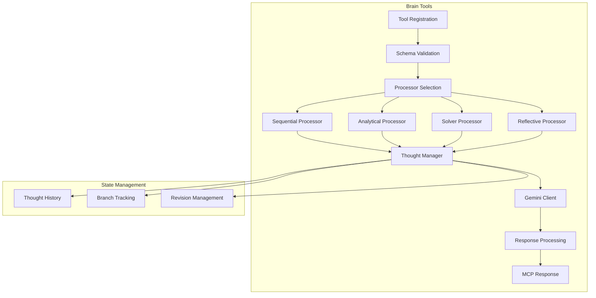

# Brain Tools Implementation Plan for Human MCP

## Overview

This plan outlines the implementation of Brain tools for Human MCP, incorporating sequential thinking and chain-of-thought reasoning capabilities. The Brain tools will provide structured problem-solving, analytical reasoning, and reflective thinking processes using Google Gemini's advanced AI capabilities.

## Requirements

### Functional Requirements
1. **Sequential Thinking**: Step-by-step problem decomposition with dynamic thought progression
2. **Analytical Reasoning**: Deep analysis with branching and exploration capabilities
3. **Problem Solving**: Multi-step solution generation with hypothesis testing
4. **Reflective Processing**: Thought revision and process optimization
5. **State Management**: Track thought history, branches, and revisions
6. **Flexible Adaptation**: Support for non-linear thinking patterns

### Technical Requirements
- Integration with existing Human MCP architecture
- Leverage Google Gemini API for AI reasoning
- Maintain compatibility with MCP tool naming conventions
- Implement robust error handling and logging
- Support for concurrent thought processing where applicable

## Architecture

### Directory Structure
```
src/tools/brain/
├── index.ts                 # Tool registration and main handler
├── schemas.ts              # Zod schemas for input/output validation
├── processors/
│   ├── sequential.ts       # Sequential thinking processor
│   ├── analytical.ts       # Analytical reasoning processor
│   ├── solver.ts          # Problem solving processor
│   └── reflective.ts      # Reflective processing processor
├── utils/
│   ├── thought-manager.ts  # Thought state management
│   ├── branch-tracker.ts   # Branch and revision tracking
│   └── prompts.ts         # Chain-of-thought prompt templates
└── types.ts               # TypeScript type definitions
```

### Component Architecture



## Implementation Approach

### Approach 1: Stateless Sequential Processing (Recommended)
**Pros:**
- Simple implementation with minimal state management
- Each tool call is independent and self-contained
- Easy to test and debug
- Lower memory footprint
- Better scalability for concurrent requests

**Cons:**
- Limited ability to maintain context across multiple calls
- Cannot easily reference previous thought sessions
- Less suitable for long-running analysis tasks

**Implementation:**
- Each tool call processes the entire thought chain in a single request
- Thought history is maintained within the request context only
- Results include complete thought progression for transparency
- Suitable for most use cases where analysis fits within a single call

### Approach 2: Stateful Session-Based Processing
**Pros:**
- Maintains context across multiple tool calls
- Supports complex, multi-stage analysis
- Enables incremental thought building
- Better for interactive problem-solving

**Cons:**
- Requires session management infrastructure
- More complex implementation and testing
- Memory management concerns for long sessions
- Potential for state synchronization issues

**Implementation:**
- Implement session IDs for tracking thought contexts
- Store thought history in memory or cache
- Provide session management commands
- Add cleanup mechanisms for expired sessions

### Recommended Approach: Stateless Sequential Processing

Based on the analysis, we recommend Approach 1 for the following reasons:
1. Aligns with MCP's stateless tool design philosophy
2. Simpler to implement and maintain
3. Better performance characteristics
4. Gemini's context window is sufficient for most use cases
5. Can be enhanced with optional state management later if needed

## Detailed Implementation Steps

### Phase 1: Core Infrastructure

#### 1.1 Create Type Definitions
```typescript
// src/tools/brain/types.ts
export interface Thought {
  number: number;
  content: string;
  timestamp: Date;
  isRevision?: boolean;
  revisesThought?: number;
  branchId?: string;
  branchFrom?: number;
  confidence?: number;
  metadata?: Record<string, any>;
}

export interface ThoughtProcess {
  thoughts: Thought[];
  totalThoughts: number;
  currentThought: number;
  branches: Map<string, Thought[]>;
  hypothesis?: string;
  conclusion?: string;
  confidence?: number;
}

export interface BrainToolOptions {
  maxThoughts?: number;
  allowBranching?: boolean;
  allowRevision?: boolean;
  includeMetadata?: boolean;
  outputFormat?: 'detailed' | 'summary';
  temperature?: number;
}
```

#### 1.2 Define Schemas
```typescript
// src/tools/brain/schemas.ts
import { z } from "zod";

export const BrainThinkInputSchema = z.object({
  problem: z.string().describe("The problem or question to think about"),
  context: z.string().optional().describe("Additional context or constraints"),
  max_thoughts: z.number().min(3).max(50).default(10).describe("Maximum number of thoughts"),
  allow_branching: z.boolean().default(true).describe("Allow exploration of alternative paths"),
  allow_revision: z.boolean().default(true).describe("Allow revision of previous thoughts"),
  output_format: z.enum(["detailed", "summary"]).default("detailed").describe("Output format")
});

export const BrainAnalyzeInputSchema = z.object({
  subject: z.string().describe("The subject to analyze"),
  aspects: z.array(z.string()).optional().describe("Specific aspects to focus on"),
  depth: z.enum(["shallow", "moderate", "deep"]).default("deep").describe("Analysis depth"),
  comparison_targets: z.array(z.string()).optional().describe("Items to compare against"),
  framework: z.string().optional().describe("Analytical framework to use"),
  output_format: z.enum(["detailed", "summary", "structured"]).default("detailed")
});

export const BrainSolveInputSchema = z.object({
  problem: z.string().describe("The problem to solve"),
  constraints: z.array(z.string()).optional().describe("Constraints or requirements"),
  approach: z.enum(["systematic", "creative", "hybrid"]).default("systematic"),
  hypothesis_testing: z.boolean().default(true).describe("Test and verify hypotheses"),
  max_iterations: z.number().min(1).max(20).default(5).describe("Maximum solving iterations"),
  success_criteria: z.string().optional().describe("Criteria for successful solution")
});

export const BrainReflectInputSchema = z.object({
  content: z.string().describe("Content to reflect upon"),
  previous_thoughts: z.array(z.string()).optional().describe("Previous thoughts to reconsider"),
  reflection_type: z.enum(["critical", "constructive", "comparative"]).default("constructive"),
  focus_areas: z.array(z.string()).optional().describe("Specific areas to focus reflection on"),
  improvement_suggestions: z.boolean().default(true).describe("Include improvement suggestions")
});
```

### Phase 2: Processor Implementation

#### 2.1 Sequential Thinking Processor
```typescript
// src/tools/brain/processors/sequential.ts
export class SequentialProcessor {
  constructor(private geminiClient: GeminiClient) {}

  async process(input: BrainThinkInput): Promise<ThoughtProcess> {
    const thoughts: Thought[] = [];
    const branches = new Map<string, Thought[]>();
    let currentThought = 1;
    let totalThoughts = input.max_thoughts || 10;

    while (currentThought <= totalThoughts) {
      const thought = await this.generateThought(
        input.problem,
        thoughts,
        currentThought,
        totalThoughts
      );

      thoughts.push(thought);

      // Check if we need more thoughts
      if (thought.metadata?.needsMoreThoughts) {
        totalThoughts = Math.min(totalThoughts + 5, 50);
      }

      // Handle branching
      if (thought.branchId && input.allow_branching) {
        this.handleBranching(thought, branches);
      }

      currentThought++;
    }

    // Generate conclusion
    const conclusion = await this.generateConclusion(thoughts, input.problem);

    return {
      thoughts,
      totalThoughts,
      currentThought: currentThought - 1,
      branches,
      conclusion,
      confidence: this.calculateConfidence(thoughts)
    };
  }

  private async generateThought(...): Promise<Thought> {
    // Implementation details
  }
}
```

#### 2.2 Thought Manager
```typescript
// src/tools/brain/utils/thought-manager.ts
export class ThoughtManager {
  private thoughts: Map<string, Thought[]> = new Map();
  private branches: Map<string, Map<string, Thought[]>> = new Map();

  addThought(sessionId: string, thought: Thought): void {
    if (!this.thoughts.has(sessionId)) {
      this.thoughts.set(sessionId, []);
    }
    this.thoughts.get(sessionId)!.push(thought);
  }

  getThoughts(sessionId: string): Thought[] {
    return this.thoughts.get(sessionId) || [];
  }

  createBranch(sessionId: string, branchId: string, fromThought: number): void {
    // Branch creation logic
  }

  reviseThought(sessionId: string, thoughtNumber: number, newContent: string): Thought {
    // Revision logic
  }
}
```

### Phase 3: Tool Registration

#### 3.1 Main Registration
```typescript
// src/tools/brain/index.ts
export async function registerBrainTool(server: McpServer, config: Config) {
  const geminiClient = new GeminiClient(config);

  // Register brain_think tool
  server.registerTool(
    "brain_think",
    {
      title: "Sequential Thinking Tool",
      description: "Engage in structured sequential thinking to solve problems step-by-step",
      inputSchema: BrainThinkInputSchema
    },
    async (args) => {
      try {
        const processor = new SequentialProcessor(geminiClient);
        const result = await processor.process(args);
        return formatThoughtProcessResponse(result);
      } catch (error) {
        return handleBrainToolError(error);
      }
    }
  );

  // Register brain_analyze tool
  server.registerTool(
    "brain_analyze",
    {
      title: "Deep Analysis Tool",
      description: "Perform deep analytical reasoning with branching exploration",
      inputSchema: BrainAnalyzeInputSchema
    },
    async (args) => {
      // Implementation
    }
  );

  // Additional tool registrations...
}
```

### Phase 4: Prompt Engineering

#### 4.1 Chain-of-Thought Prompts
```typescript
// src/tools/brain/utils/prompts.ts
export const SEQUENTIAL_THINKING_PROMPT = `
You are engaged in sequential thinking to solve a problem. Follow these guidelines:

1. Break down the problem into logical steps
2. Each thought should build on previous insights
3. Question assumptions when necessary
4. Revise previous thoughts if new information contradicts them
5. Explore alternative paths when stuck
6. Generate hypotheses and test them
7. Conclude with a clear, justified answer

Problem: {problem}
Context: {context}
Previous Thoughts: {thoughts}

Current Thought {number}/{total}:
- What aspect should I focus on now?
- How does this relate to previous thoughts?
- Am I making progress toward a solution?
- Do I need to revise any previous assumptions?
- Should I explore an alternative approach?

Provide your thought in a clear, structured manner.
`;

export const ANALYTICAL_REASONING_PROMPT = `
Perform deep analytical reasoning on the following subject:

Subject: {subject}
Aspects to analyze: {aspects}
Framework: {framework}

Structure your analysis as follows:
1. Initial observations
2. Detailed examination of each aspect
3. Relationships and patterns
4. Comparative analysis (if applicable)
5. Synthesis and insights
6. Conclusions and implications

Use branching to explore alternative interpretations when appropriate.
`;
```

## Testing Strategy

### Unit Tests
1. Schema validation tests
2. Processor logic tests
3. Thought manager state tests
4. Branch tracking tests
5. Prompt generation tests

### Integration Tests
1. End-to-end tool execution
2. Gemini API integration
3. Error handling scenarios
4. Performance tests with varying thought counts
5. Branching and revision scenarios

### Example Test Cases
```typescript
// tests/unit/brain/sequential.test.ts
describe("SequentialProcessor", () => {
  it("should generate sequential thoughts", async () => {
    const processor = new SequentialProcessor(mockGeminiClient);
    const result = await processor.process({
      problem: "How to optimize database queries?",
      max_thoughts: 5
    });

    expect(result.thoughts).toHaveLength(5);
    expect(result.conclusion).toBeDefined();
  });

  it("should handle thought revision", async () => {
    // Test revision logic
  });

  it("should support branching", async () => {
    // Test branching logic
  });
});
```

## Performance Considerations

### Optimization Strategies
1. **Prompt Caching**: Cache frequently used prompt templates
2. **Batch Processing**: Process multiple thoughts in parallel where possible
3. **Response Streaming**: Stream thoughts as they're generated
4. **Memory Management**: Implement thought history limits
5. **Rate Limiting**: Respect Gemini API rate limits

### Performance Metrics
- Average thought generation time: < 500ms
- Complete analysis time: < 10 seconds for 10 thoughts
- Memory usage per session: < 10MB
- Concurrent session support: 100+ sessions

## Security Considerations

1. **Input Validation**: Strict schema validation for all inputs
2. **Content Filtering**: Filter sensitive information from thoughts
3. **Rate Limiting**: Prevent abuse through rate limiting
4. **Sanitization**: Sanitize user inputs before processing
5. **Error Messages**: Avoid exposing internal details in errors

## Migration and Rollout

### Phase 1: Internal Testing
- Deploy to development environment
- Run comprehensive test suite
- Conduct performance testing

### Phase 2: Beta Release
- Enable for select users
- Monitor performance and errors
- Gather feedback on usability

### Phase 3: General Availability
- Full deployment
- Documentation updates
- Example implementations

## Future Enhancements

1. **Memory Systems**: Long-term memory for cross-session learning
2. **Multi-Modal Reasoning**: Integrate with Eyes tools for visual reasoning
3. **Collaborative Thinking**: Multiple agents working on same problem
4. **Custom Frameworks**: User-defined thinking frameworks
5. **Learning Optimization**: Adaptive thought generation based on success patterns

## Risk Assessment

### Technical Risks
- **API Limitations**: Gemini API rate limits may constrain usage
- **Context Window**: Large thought chains may exceed context limits
- **Latency**: Network latency may impact real-time thinking

### Mitigation Strategies
- Implement caching and batching
- Use thought summarization for long chains
- Add timeout and retry mechanisms

## Documentation Requirements

1. **API Documentation**: Complete tool API reference
2. **Usage Examples**: Common use case examples
3. **Best Practices**: Guidelines for effective use
4. **Troubleshooting**: Common issues and solutions
5. **Integration Guide**: How to integrate with other tools

## Success Metrics

1. **Functionality**: All four Brain tools operational
2. **Performance**: Meeting performance targets
3. **Reliability**: 99.9% uptime
4. **User Satisfaction**: Positive feedback from users
5. **Integration**: Seamless integration with existing tools

## TODO Checklist

- [ ] Create directory structure for Brain tools
- [ ] Implement type definitions and interfaces
- [ ] Define Zod schemas for all tools
- [ ] Implement SequentialProcessor class
- [ ] Implement AnalyticalProcessor class
- [ ] Implement SolverProcessor class
- [ ] Implement ReflectiveProcessor class
- [ ] Create ThoughtManager for state management
- [ ] Implement BranchTracker for branching logic
- [ ] Design and implement prompt templates
- [ ] Register all Brain tools with MCP server
- [ ] Add comprehensive error handling
- [ ] Implement logging throughout
- [ ] Write unit tests for all components
- [ ] Write integration tests
- [ ] Perform performance testing
- [ ] Create usage documentation
- [ ] Add example implementations
- [ ] Conduct security review
- [ ] Deploy to test environment
- [ ] Gather feedback and iterate

## Conclusion

This implementation plan provides a comprehensive approach to adding Brain tools to Human MCP. The recommended stateless sequential processing approach offers a balance of functionality and simplicity while maintaining compatibility with the existing architecture. The modular design allows for future enhancements and the robust testing strategy ensures reliability.

The Brain tools will significantly enhance Human MCP's capabilities by providing structured thinking, deep analysis, problem-solving, and reflective processing abilities that complement the existing Eyes (vision), Hands (generation), and Mouth (speech) tools.