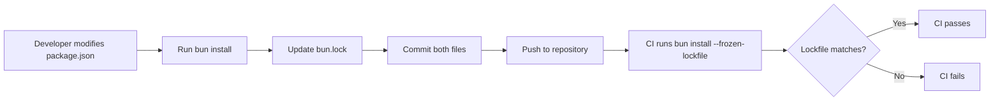
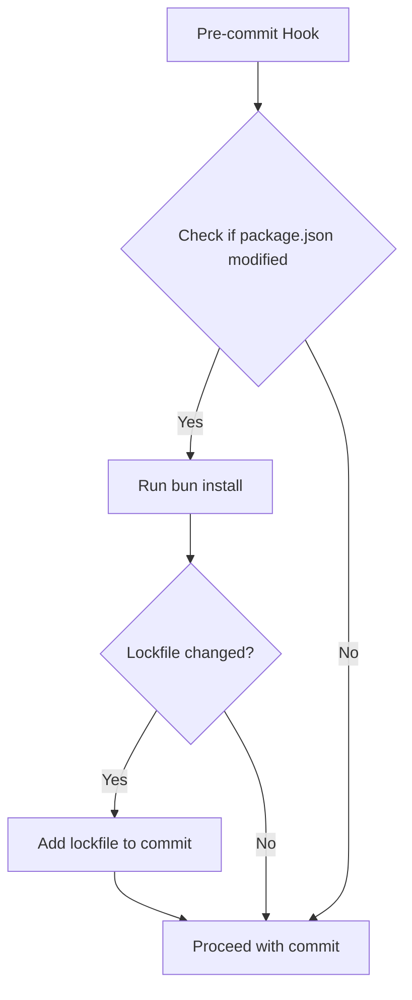

# Implementation Plan: Fix CI Lockfile Failure

## Overview

The GitHub Actions CI pipeline is failing with the error "lockfile had changes, but lockfile is frozen" during the `bun install --frozen-lockfile` step. This is caused by an outdated `bun.lock` file that doesn't reflect recent dependency changes in `package.json`.

## Root Cause Analysis

### Primary Issue
- **Error**: `bun install --frozen-lockfile` fails in CI
- **Cause**: The `bun.lock` file is out of sync with `package.json`
- **Specific Changes**: Dependencies `pdf-parse` and `tesseract.js` were removed from `package.json` but their entries remain in the lockfile
- **Affected Commit**: Started after commit a8304a5 (feat(hands): implement image generation tool)

### Secondary Issues
1. **Uncommitted Changes**: There are uncommitted mouth tools implementation files that need to be properly handled
2. **Process Gap**: No pre-commit hook to prevent lockfile sync issues
3. **CI Visibility**: The error message doesn't clearly indicate which dependencies are causing the issue

## Requirements

### Immediate Fixes (P0)
1. Update `bun.lock` to match current `package.json`
2. Commit and push the updated lockfile to fix CI
3. Ensure all tests pass with the updated dependencies

### Short-term Improvements (P1)
1. Properly commit the mouth tools implementation
2. Verify no new dependencies are missing from lockfile
3. Add validation to prevent future occurrences

### Long-term Improvements (P2)
1. Add pre-commit hooks for dependency validation
2. Improve CI error messages for lockfile issues
3. Document the process for dependency management

## Architecture & Design

### Dependency Management Flow


### Validation Strategy


## Implementation Steps

### Phase 1: Fix Immediate CI Failure

#### Step 1.1: Update Lockfile
```bash
# Navigate to project directory
cd /Users/duynguyen/www/human-mcp

# Run bun install to update lockfile
bun install

# Verify the changes
git diff bun.lock
```

#### Step 1.2: Commit Lockfile Fix
```bash
# Stage the lockfile changes
git add bun.lock

# Commit with clear message
git commit -m "fix: update bun.lock to match package.json dependencies

- Remove orphaned entries for pdf-parse and tesseract.js
- Clean up related dependencies (bmp-js, idb-keyval, is-url, node-ensure, node-fetch)
- Resolves CI failure: lockfile had changes, but lockfile is frozen"

# Push to fix CI
git push origin main
```

### Phase 2: Handle Uncommitted Changes

#### Step 2.1: Review Uncommitted Changes
```bash
# Check status of uncommitted files
git status

# Review each file's changes
git diff README.md
git diff docs/project-roadmap.md
git diff src/server.ts
git diff src/tools/eyes/utils/gemini-client.ts
```

#### Step 2.2: Handle Mouth Tools Implementation
```bash
# Option A: If mouth tools are ready to commit
git add src/tools/mouth/
git add [other related files]
git commit -m "feat(mouth): implement speech generation tools"

# Option B: If mouth tools need more work
git stash push -m "WIP: mouth tools implementation"
```

### Phase 3: Add Preventive Measures

#### Step 3.1: Create Pre-commit Hook
Create `.husky/pre-commit` file:
```bash
#!/bin/sh
. "$(dirname "$0")/_/husky.sh"

# Check if package.json is modified
if git diff --cached --name-only | grep -q "package.json"; then
  echo "📦 package.json modified, updating lockfile..."
  bun install

  # Check if lockfile changed
  if git diff --name-only | grep -q "bun.lock"; then
    echo "🔒 Adding updated lockfile to commit..."
    git add bun.lock
  fi
fi

# Run tests
bun test
```

#### Step 3.2: Add Package Scripts
Update `package.json`:
```json
{
  "scripts": {
    "prepare": "husky install",
    "pre-commit": "bun install && git add bun.lock",
    "verify-lockfile": "bun install --frozen-lockfile"
  }
}
```

#### Step 3.3: Update CI Workflow
Enhance `.github/workflows/test.yml`:
```yaml
- name: Verify lockfile
  run: |
    bun install
    if git diff --exit-code bun.lock; then
      echo "✅ Lockfile is up to date"
    else
      echo "❌ Lockfile needs update. Run 'bun install' and commit the changes."
      git diff bun.lock
      exit 1
    fi
```

## Testing Strategy

### Unit Tests
1. Verify all existing tests pass with updated dependencies
2. Test that removed dependencies aren't referenced anywhere
3. Validate mouth tools tests (if applicable)

### Integration Tests
1. Run full test suite: `bun test`
2. Verify CI pipeline passes after lockfile update
3. Test pre-commit hooks work correctly

### Manual Verification
1. Fresh clone and install: `git clone && bun install --frozen-lockfile`
2. Verify development workflow: `bun run dev`
3. Check production build: `bun run build && bun run start`

## Risk Assessment

### Risks
1. **Breaking Changes**: Removing dependencies might break existing functionality
   - **Mitigation**: Run comprehensive test suite before committing

2. **Incomplete Implementation**: Mouth tools might have dependencies not yet added
   - **Mitigation**: Review mouth tools requirements before committing

3. **CI Cache Issues**: CI might cache old dependencies
   - **Mitigation**: Clear CI cache if issues persist

### Rollback Plan
1. If CI still fails after lockfile update:
   ```bash
   git revert HEAD
   git push origin main
   ```

2. Investigate specific dependency issues:
   ```bash
   bun install --verbose
   bun why [package-name]
   ```

## Success Criteria

1. ✅ CI pipeline passes successfully
2. ✅ No lockfile sync warnings in CI
3. ✅ All tests pass
4. ✅ Development environment works correctly
5. ✅ Pre-commit hooks prevent future lockfile issues

## Timeline

- **Immediate (5 mins)**: Update and commit lockfile to fix CI
- **Short-term (30 mins)**: Handle uncommitted changes and verify tests
- **Long-term (1 hour)**: Implement pre-commit hooks and CI improvements

## TODO Checklist

- [ ] Run `bun install` to update lockfile
- [ ] Commit updated `bun.lock` file
- [ ] Push to fix CI pipeline
- [ ] Verify CI passes
- [ ] Review and handle uncommitted mouth tools changes
- [ ] Run full test suite locally
- [ ] Implement pre-commit hook for lockfile validation
- [ ] Update documentation for dependency management process
- [ ] Set up team notification about the fix
- [ ] Monitor CI for any related issues

## Commands Summary

```bash
# Fix immediate issue
bun install
git add bun.lock
git commit -m "fix: update bun.lock to match package.json dependencies"
git push origin main

# Verify fix
gh run list --repo mrgoonie/human-mcp --limit 1
gh run view --repo mrgoonie/human-mcp

# Setup prevention
npm install -D husky
npx husky install
npx husky add .husky/pre-commit "bun test"
```

## Notes

- The issue was introduced in commit a8304a5 when `pdf-parse` and `tesseract.js` were removed from dependencies
- The CI uses `--frozen-lockfile` flag which is a best practice to ensure reproducible builds
- Consider adding a GitHub Action that automatically creates PRs for lockfile updates when package.json changes