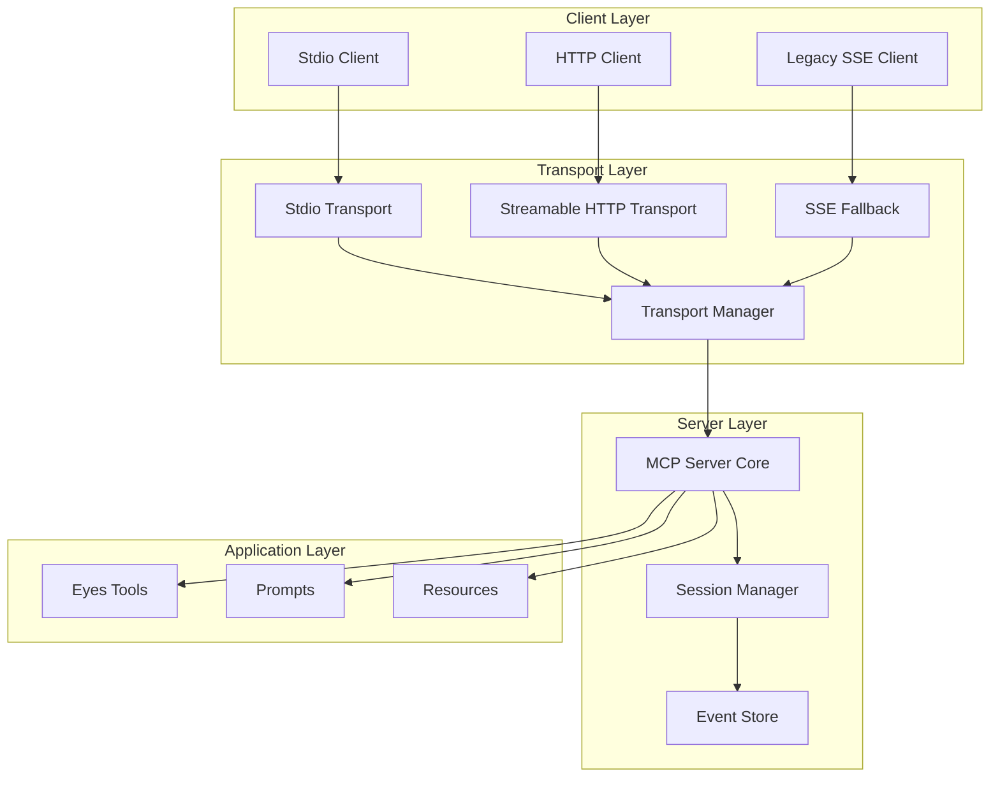

# Implementation Plan: Adding Streamable HTTP Transport to Human MCP Server

## Overview

This document outlines the comprehensive plan for adding Streamable HTTP transport support to the Human MCP server while maintaining backward compatibility with the existing stdio transport. The implementation will follow MCP specification version 2025-03-26 for Streamable HTTP transport.

## Current State Analysis

### Existing Architecture
- **Transport**: Currently only supports stdio transport via `StdioServerTransport`
- **Entry Point**: `src/index.ts` directly calls `startStdioServer()`
- **Server Creation**: `src/server.ts` contains `createServer()` and `startStdioServer()` functions
- **Configuration**: Environment-based config via `src/utils/config.ts`
- **Tools**: Two vision analysis tools (`eyes.analyze` and `eyes.compare`)
- **Dependencies**: Uses `@modelcontextprotocol/sdk` version 1.4.0

### Key Findings
- No Express or HTTP server infrastructure exists
- Configuration already supports server settings (port, timeouts, security)
- Clean separation between server creation and transport initialization
- TypeScript with ESNext modules and Bun runtime

## Requirements

### Functional Requirements
1. **Dual Transport Support**: Support both stdio and Streamable HTTP transports
2. **Session Management**: Implement stateful session handling with resumability
3. **SSE Support**: Enable Server-Sent Events for notifications
4. **Backward Compatibility**: Maintain existing stdio functionality
5. **Stateless Mode**: Support stateless operation for serverless deployments
6. **Security**: Implement CORS, DNS rebinding protection, and optional authentication

### Non-Functional Requirements
1. **Performance**: Handle concurrent sessions efficiently
2. **Scalability**: Support horizontal scaling with external session storage
3. **Maintainability**: Clean code architecture with separation of concerns
4. **Testing**: Comprehensive test coverage for all transport modes
5. **Documentation**: Clear documentation for configuration and usage

## Architecture Design

### High-Level Architecture



### Component Design

#### 1. Transport Manager
- Handles transport selection based on startup mode
- Manages transport lifecycle
- Provides unified interface for different transports

#### 2. HTTP Server Module
- Express-based HTTP server
- Route handlers for MCP endpoints
- Middleware for security and logging

#### 3. Session Manager
- In-memory session storage (default)
- Interface for external storage adapters
- Session lifecycle management

#### 4. Security Module
- CORS configuration
- DNS rebinding protection
- Rate limiting
- Optional authentication

## Implementation Approaches

### Approach 1: Modular Transport System (Recommended)

**Description**: Create a modular transport system with pluggable transports and a unified startup mechanism.

**Pros**:
- Clean separation of concerns
- Easy to add new transports in the future
- Testable components
- Supports dynamic transport selection
- Better code organization

**Cons**:
- More initial setup complexity
- Requires refactoring existing code structure
- More files to manage

**Implementation Structure**:
```
src/
├── transports/
│   ├── index.ts           # Transport manager
│   ├── stdio.ts           # Stdio transport wrapper
│   ├── http/
│   │   ├── server.ts      # Express server setup
│   │   ├── routes.ts      # Route handlers
│   │   ├── middleware.ts  # Security & logging
│   │   └── session.ts     # Session management
│   └── types.ts           # Transport interfaces
├── server.ts              # Refactored server creation
└── index.ts               # Unified entry point
```

### Approach 2: Minimal Integration

**Description**: Add HTTP support directly in existing files with minimal structural changes.

**Pros**:
- Minimal changes to existing code
- Faster initial implementation
- Less file reorganization

**Cons**:
- Less maintainable long-term
- Harder to test components independently
- Mixed concerns in single files
- Limited extensibility

**Implementation Structure**:
```
src/
├── server.ts      # Add HTTP functions here
├── http.ts        # All HTTP-related code
└── index.ts       # Modified entry point
```

## Detailed Implementation Plan (Approach 1 - Recommended)

### Phase 1: Foundation (Week 1)

#### 1.1 Install Dependencies
```json
{
  "dependencies": {
    "express": "^4.21.0",
    "cors": "^2.8.5",
    "compression": "^1.7.4",
    "helmet": "^7.1.0"
  },
  "devDependencies": {
    "@types/express": "^4.17.21",
    "@types/cors": "^2.8.17",
    "@types/compression": "^1.7.5"
  }
}
```

#### 1.2 Create Transport Interfaces
**File**: `src/transports/types.ts`
```typescript
export interface TransportConfig {
  type: 'stdio' | 'http' | 'both';
  http?: HttpTransportConfig;
}

export interface HttpTransportConfig {
  port: number;
  host?: string;
  sessionMode: 'stateful' | 'stateless';
  enableSse?: boolean;
  enableJsonResponse?: boolean;
  security?: SecurityConfig;
}

export interface SecurityConfig {
  enableCors?: boolean;
  corsOrigins?: string[];
  enableDnsRebindingProtection?: boolean;
  allowedHosts?: string[];
  enableRateLimiting?: boolean;
  secret?: string;
}

export interface SessionStore {
  get(sessionId: string): Promise<TransportSession | null>;
  set(sessionId: string, session: TransportSession): Promise<void>;
  delete(sessionId: string): Promise<void>;
  cleanup(): Promise<void>;
}
```

#### 1.3 Create Transport Manager
**File**: `src/transports/index.ts`
```typescript
import { McpServer } from "@modelcontextprotocol/sdk/server/mcp.js";
import { startStdioTransport } from "./stdio.js";
import { startHttpTransport } from "./http/server.js";
import type { TransportConfig } from "./types.js";

export class TransportManager {
  private server: McpServer;
  private config: TransportConfig;

  constructor(server: McpServer, config: TransportConfig) {
    this.server = server;
    this.config = config;
  }

  async start(): Promise<void> {
    switch (this.config.type) {
      case 'stdio':
        await startStdioTransport(this.server);
        break;
      case 'http':
        await startHttpTransport(this.server, this.config.http!);
        break;
      case 'both':
        await Promise.all([
          startStdioTransport(this.server),
          startHttpTransport(this.server, this.config.http!)
        ]);
        break;
    }
  }
}
```

### Phase 2: HTTP Server Implementation (Week 1-2)

#### 2.1 Express Server Setup
**File**: `src/transports/http/server.ts`
```typescript
import express from "express";
import cors from "cors";
import compression from "compression";
import helmet from "helmet";
import { McpServer } from "@modelcontextprotocol/sdk/server/mcp.js";
import { StreamableHTTPServerTransport } from "@modelcontextprotocol/sdk/server/streamableHttp.js";
import { createRoutes } from "./routes.js";
import { SessionManager } from "./session.js";
import { createSecurityMiddleware } from "./middleware.js";
import type { HttpTransportConfig } from "../types.js";

export async function startHttpTransport(
  mcpServer: McpServer,
  config: HttpTransportConfig
): Promise<void> {
  const app = express();
  const sessionManager = new SessionManager(config.sessionMode);

  // Apply middleware
  app.use(express.json({ limit: '50mb' }));
  app.use(compression());
  app.use(helmet());
  
  if (config.security?.enableCors) {
    app.use(cors({
      origin: config.security.corsOrigins || '*',
      exposedHeaders: ['Mcp-Session-Id'],
      allowedHeaders: ['Content-Type', 'mcp-session-id'],
    }));
  }

  app.use(createSecurityMiddleware(config.security));

  // Create routes
  const routes = createRoutes(mcpServer, sessionManager, config);
  app.use('/mcp', routes);

  // Health check endpoint
  app.get('/health', (req, res) => {
    res.json({ status: 'healthy', transport: 'streamable-http' });
  });

  // Start server
  const port = config.port || 3000;
  const host = config.host || '0.0.0.0';
  
  app.listen(port, host, () => {
    console.log(`MCP HTTP Server listening on http://${host}:${port}`);
  });
}
```

#### 2.2 Route Handlers
**File**: `src/transports/http/routes.ts`
```typescript
import { Router } from "express";
import { randomUUID } from "node:crypto";
import { McpServer } from "@modelcontextprotocol/sdk/server/mcp.js";
import { StreamableHTTPServerTransport } from "@modelcontextprotocol/sdk/server/streamableHttp.js";
import { isInitializeRequest } from "@modelcontextprotocol/sdk/types.js";
import { SessionManager } from "./session.js";
import type { HttpTransportConfig } from "../types.js";

export function createRoutes(
  mcpServer: McpServer,
  sessionManager: SessionManager,
  config: HttpTransportConfig
): Router {
  const router = Router();

  // POST /mcp - Handle client requests
  router.post('/', async (req, res) => {
    try {
      const sessionId = req.headers['mcp-session-id'] as string | undefined;
      
      if (config.sessionMode === 'stateless') {
        await handleStatelessRequest(mcpServer, req, res);
      } else {
        await handleStatefulRequest(mcpServer, sessionManager, sessionId, req, res);
      }
    } catch (error) {
      handleError(res, error);
    }
  });

  // GET /mcp - SSE endpoint for notifications
  router.get('/', async (req, res) => {
    if (config.sessionMode === 'stateless') {
      res.status(405).json({
        jsonrpc: "2.0",
        error: {
          code: -32000,
          message: "SSE not supported in stateless mode"
        },
        id: null
      });
      return;
    }

    const sessionId = req.headers['mcp-session-id'] as string;
    const transport = await sessionManager.getTransport(sessionId);
    
    if (!transport) {
      res.status(400).send('Invalid or missing session ID');
      return;
    }

    await transport.handleRequest(req, res);
  });

  // DELETE /mcp - Session termination
  router.delete('/', async (req, res) => {
    if (config.sessionMode === 'stateless') {
      res.status(405).json({
        jsonrpc: "2.0",
        error: {
          code: -32000,
          message: "Session termination not applicable in stateless mode"
        },
        id: null
      });
      return;
    }

    const sessionId = req.headers['mcp-session-id'] as string;
    await sessionManager.terminateSession(sessionId);
    res.status(204).send();
  });

  return router;
}

async function handleStatelessRequest(
  mcpServer: McpServer,
  req: any,
  res: any
): Promise<void> {
  const transport = new StreamableHTTPServerTransport({
    sessionIdGenerator: undefined,
  });

  res.on('close', () => {
    transport.close();
  });

  await mcpServer.connect(transport);
  await transport.handleRequest(req, res, req.body);
}

async function handleStatefulRequest(
  mcpServer: McpServer,
  sessionManager: SessionManager,
  sessionId: string | undefined,
  req: any,
  res: any
): Promise<void> {
  let transport = sessionId ? 
    await sessionManager.getTransport(sessionId) : null;

  if (!transport && isInitializeRequest(req.body)) {
    transport = await sessionManager.createSession(mcpServer);
    res.setHeader('Mcp-Session-Id', transport.sessionId);
  } else if (!transport) {
    res.status(400).json({
      jsonrpc: '2.0',
      error: {
        code: -32000,
        message: 'Bad Request: No valid session ID provided',
      },
      id: null,
    });
    return;
  }

  await transport.handleRequest(req, res, req.body);
}

function handleError(res: any, error: any): void {
  console.error('MCP request error:', error);
  if (!res.headersSent) {
    res.status(500).json({
      jsonrpc: '2.0',
      error: {
        code: -32603,
        message: 'Internal server error',
      },
      id: null,
    });
  }
}
```

#### 2.3 Session Management
**File**: `src/transports/http/session.ts`
```typescript
import { randomUUID } from "node:crypto";
import { McpServer } from "@modelcontextprotocol/sdk/server/mcp.js";
import { StreamableHTTPServerTransport } from "@modelcontextprotocol/sdk/server/streamableHttp.js";
import type { SessionStore } from "../types.js";

export class SessionManager {
  private transports: Map<string, StreamableHTTPServerTransport>;
  private sessionMode: 'stateful' | 'stateless';
  private store?: SessionStore;

  constructor(sessionMode: 'stateful' | 'stateless', store?: SessionStore) {
    this.transports = new Map();
    this.sessionMode = sessionMode;
    this.store = store;
  }

  async createSession(mcpServer: McpServer): Promise<StreamableHTTPServerTransport> {
    const sessionId = randomUUID();
    
    const transport = new StreamableHTTPServerTransport({
      sessionIdGenerator: () => sessionId,
      enableJsonResponse: true,
      enableDnsRebindingProtection: true,
      allowedHosts: ['127.0.0.1', 'localhost'],
    });

    transport.onclose = () => {
      this.terminateSession(sessionId);
    };

    this.transports.set(sessionId, transport);
    
    if (this.store) {
      await this.store.set(sessionId, {
        id: sessionId,
        createdAt: Date.now(),
        transport: transport
      });
    }

    await mcpServer.connect(transport);
    return transport;
  }

  async getTransport(sessionId: string): Promise<StreamableHTTPServerTransport | null> {
    let transport = this.transports.get(sessionId);
    
    if (!transport && this.store) {
      const session = await this.store.get(sessionId);
      if (session) {
        transport = session.transport;
        this.transports.set(sessionId, transport);
      }
    }
    
    return transport || null;
  }

  async terminateSession(sessionId: string): Promise<void> {
    const transport = this.transports.get(sessionId);
    if (transport) {
      transport.close();
      this.transports.delete(sessionId);
    }
    
    if (this.store) {
      await this.store.delete(sessionId);
    }
  }

  async cleanup(): Promise<void> {
    for (const [sessionId, transport] of this.transports) {
      transport.close();
    }
    this.transports.clear();
    
    if (this.store) {
      await this.store.cleanup();
    }
  }
}
```

### Phase 3: Configuration & Integration (Week 2)

#### 3.1 Update Configuration
**File**: `src/utils/config.ts` (additions)
```typescript
transport: z.object({
  type: z.enum(["stdio", "http", "both"]).default("stdio"),
  http: z.object({
    enabled: z.boolean().default(false),
    port: z.number().default(3000),
    host: z.string().default("0.0.0.0"),
    sessionMode: z.enum(["stateful", "stateless"]).default("stateful"),
    enableSse: z.boolean().default(true),
    enableJsonResponse: z.boolean().default(true),
    cors: z.object({
      enabled: z.boolean().default(true),
      origins: z.array(z.string()).optional(),
    }).optional(),
    dnsRebinding: z.object({
      enabled: z.boolean().default(true),
      allowedHosts: z.array(z.string()).default(["127.0.0.1", "localhost"]),
    }).optional(),
  }).optional(),
}),
```

#### 3.2 Update Entry Point
**File**: `src/index.ts`
```typescript
#!/usr/bin/env bun

import { createServer } from "./server.js";
import { TransportManager } from "./transports/index.js";
import { loadConfig } from "./utils/config.js";
import { logger } from "./utils/logger.js";

async function main() {
  try {
    const config = loadConfig();
    const server = await createServer();
    
    const transportConfig = {
      type: config.transport.type,
      http: config.transport.http
    };
    
    const transportManager = new TransportManager(server, transportConfig);
    await transportManager.start();
    
    logger.info(`Human MCP Server started with ${config.transport.type} transport`);
    
    // Graceful shutdown
    process.on('SIGINT', async () => {
      logger.info('Shutting down server...');
      process.exit(0);
    });
    
  } catch (error) {
    logger.error('Failed to start server:', error);
    process.exit(1);
  }
}

main();
```

#### 3.3 Update Environment Variables
**File**: `.env.example` (additions)
```bash
# Transport Configuration
TRANSPORT_TYPE=http # stdio, http, or both
HTTP_PORT=3000
HTTP_HOST=0.0.0.0
HTTP_SESSION_MODE=stateful # stateful or stateless
HTTP_ENABLE_SSE=true
HTTP_ENABLE_JSON_RESPONSE=true

# CORS Configuration
HTTP_CORS_ENABLED=true
HTTP_CORS_ORIGINS=http://localhost:3000,https://app.example.com

# DNS Rebinding Protection
HTTP_DNS_REBINDING_ENABLED=true
HTTP_ALLOWED_HOSTS=127.0.0.1,localhost
```

### Phase 4: Security & Middleware (Week 2-3)

#### 4.1 Security Middleware
**File**: `src/transports/http/middleware.ts`
```typescript
import { Request, Response, NextFunction } from "express";
import type { SecurityConfig } from "../types.js";

export function createSecurityMiddleware(config?: SecurityConfig) {
  return async (req: Request, res: Response, next: NextFunction) => {
    // DNS Rebinding Protection
    if (config?.enableDnsRebindingProtection) {
      const host = req.headers.host?.split(':')[0];
      const allowedHosts = config.allowedHosts || ['127.0.0.1', 'localhost'];
      
      if (host && !allowedHosts.includes(host)) {
        res.status(403).json({
          error: 'Forbidden: Invalid host'
        });
        return;
      }
    }

    // Rate Limiting (basic implementation)
    if (config?.enableRateLimiting) {
      // Implement rate limiting logic here
      // Could use express-rate-limit package
    }

    // Secret-based authentication (optional)
    if (config?.secret) {
      const authHeader = req.headers.authorization;
      if (!authHeader || !authHeader.startsWith('Bearer ')) {
        res.status(401).json({
          error: 'Unauthorized: Missing authentication'
        });
        return;
      }
      
      const token = authHeader.substring(7);
      if (token !== config.secret) {
        res.status(401).json({
          error: 'Unauthorized: Invalid token'
        });
        return;
      }
    }

    next();
  };
}
```

### Phase 5: Testing Strategy (Week 3)

#### 5.1 Unit Tests
```typescript
// tests/transports/session.test.ts
import { describe, it, expect } from "bun:test";
import { SessionManager } from "@/transports/http/session";

describe("SessionManager", () => {
  it("should create and retrieve sessions", async () => {
    const manager = new SessionManager('stateful');
    const transport = await manager.createSession(mockServer);
    expect(transport.sessionId).toBeDefined();
    
    const retrieved = await manager.getTransport(transport.sessionId);
    expect(retrieved).toBe(transport);
  });
  
  it("should terminate sessions", async () => {
    const manager = new SessionManager('stateful');
    const transport = await manager.createSession(mockServer);
    await manager.terminateSession(transport.sessionId);
    
    const retrieved = await manager.getTransport(transport.sessionId);
    expect(retrieved).toBeNull();
  });
});
```

#### 5.2 Integration Tests
```typescript
// tests/integration/http-transport.test.ts
import { describe, it, expect } from "bun:test";
import request from "supertest";

describe("HTTP Transport", () => {
  it("should handle initialize request", async () => {
    const response = await request(app)
      .post('/mcp')
      .send({
        jsonrpc: "2.0",
        method: "initialize",
        params: {
          protocolVersion: "2025-03-26",
          capabilities: {}
        },
        id: 1
      });
    
    expect(response.status).toBe(200);
    expect(response.headers['mcp-session-id']).toBeDefined();
  });
  
  it("should handle tool calls", async () => {
    // Initialize session first
    const initResponse = await request(app)
      .post('/mcp')
      .send(initializeRequest);
    
    const sessionId = initResponse.headers['mcp-session-id'];
    
    // Call tool
    const toolResponse = await request(app)
      .post('/mcp')
      .set('mcp-session-id', sessionId)
      .send({
        jsonrpc: "2.0",
        method: "tools/call",
        params: {
          name: "eyes.analyze",
          arguments: {
            source: "test.jpg",
            type: "image"
          }
        },
        id: 2
      });
    
    expect(toolResponse.status).toBe(200);
  });
});
```

### Phase 6: Documentation & Deployment (Week 3-4)

#### 6.1 Update README.md
```markdown
## Transport Options

Human MCP supports multiple transport mechanisms:

### Stdio Transport (Default)
```bash
bun run start
```

### HTTP Transport
```bash
TRANSPORT_TYPE=http bun run start
```

### Both Transports
```bash
TRANSPORT_TYPE=both bun run start
```

## HTTP API Endpoints

- `POST /mcp` - Handle client requests
- `GET /mcp` - SSE endpoint for notifications (stateful mode only)
- `DELETE /mcp` - Terminate session (stateful mode only)
- `GET /health` - Health check endpoint

## Session Modes

### Stateful Mode (Default)
- Maintains session state between requests
- Supports SSE notifications
- Enables session resumability
- Requires session ID management

### Stateless Mode
- No session persistence
- Each request is independent
- Suitable for serverless deployments
- No SSE support
```

#### 6.2 Docker Support
**File**: `Dockerfile.http`
```dockerfile
FROM oven/bun:1-alpine

WORKDIR /app

COPY package.json bun.lockb ./
RUN bun install --frozen-lockfile

COPY . .
RUN bun run build

ENV TRANSPORT_TYPE=http
ENV HTTP_PORT=3000
ENV HTTP_HOST=0.0.0.0

EXPOSE 3000

CMD ["bun", "run", "start"]
```

## Testing & Validation Strategy

### 1. Unit Testing
- Transport manager logic
- Session management
- Security middleware
- Route handlers

### 2. Integration Testing
- End-to-end HTTP requests
- Session lifecycle
- SSE notifications
- Error handling

### 3. Compatibility Testing
- Stdio transport regression
- HTTP client compatibility
- SSE fallback scenarios

### 4. Performance Testing
- Concurrent session handling
- Memory usage under load
- Response time metrics

### 5. Security Testing
- CORS validation
- DNS rebinding protection
- Rate limiting effectiveness
- Authentication mechanisms

## Risk Mitigation

### Technical Risks
1. **Breaking Changes**: Mitigated by maintaining backward compatibility and phased rollout
2. **Performance Impact**: Addressed through proper session management and optional stateless mode
3. **Security Vulnerabilities**: Mitigated with comprehensive security middleware and testing

### Implementation Risks
1. **Complexity**: Managed through modular architecture and clear separation of concerns
2. **Testing Coverage**: Ensured through comprehensive test suite at multiple levels
3. **Documentation**: Maintained through inline comments and updated README

## Success Metrics

1. **Functionality**: All existing stdio functionality preserved
2. **Performance**: HTTP response time < 100ms for tool calls
3. **Reliability**: 99.9% uptime for HTTP server
4. **Security**: Zero security vulnerabilities in OWASP top 10
5. **Adoption**: Successful integration with at least 3 different MCP clients

## Implementation Timeline

### Week 1: Foundation
- [ ] Install dependencies
- [ ] Create transport interfaces and manager
- [ ] Basic HTTP server setup

### Week 2: Core Implementation
- [ ] Route handlers implementation
- [ ] Session management
- [ ] Configuration updates

### Week 3: Security & Testing
- [ ] Security middleware
- [ ] Unit tests
- [ ] Integration tests

### Week 4: Documentation & Polish
- [ ] Documentation updates
- [ ] Docker support
- [ ] Performance optimization
- [ ] Final testing and validation

## Conclusion

This implementation plan provides a comprehensive approach to adding Streamable HTTP transport to the Human MCP server. The modular architecture ensures maintainability and extensibility while preserving backward compatibility. The phased approach allows for iterative development and testing, reducing implementation risks.

The recommended Approach 1 (Modular Transport System) provides the best balance of functionality, maintainability, and extensibility, setting up the project for future enhancements and transport options.